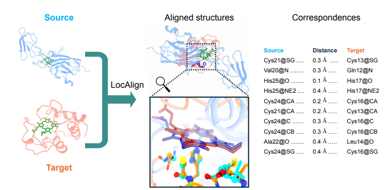
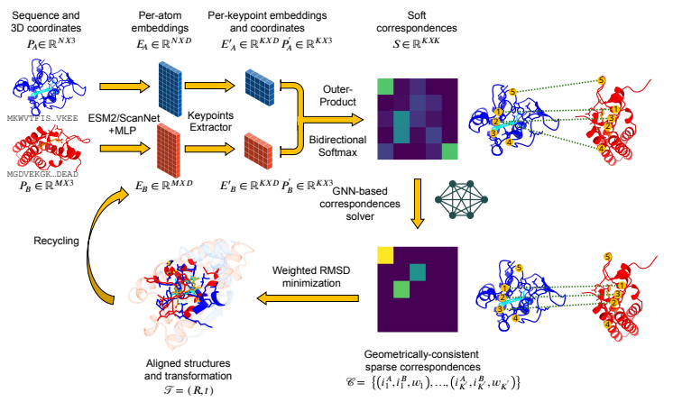

<h1 align="center">LocAlign</h1>
<h3 align="center">Local Protein Structural Alignment<br>with Geometric Deep Learning</h3>

<p align="center">
    
    <br>
    <em>Figure 1. LocAlign overview.</em>
</p>


LocAlign is a geometric deep learning-based algorithm for local structural alignment of proteins. It identifies functionally relevant structural motifs across proteins with different folds, overcoming limitations of standard alignment tools. LocAlign predicts atom-level correspondences and 3D superimpositions, enabling motif discovery, functional annotation, and drug off-target screening without requiring ground-truth alignments.


<p align="center">
    
    <br>
    <em>Figure 2. LocAlign architecture.</em>
</p>


## How to run LocAlign inference:

### 1. Install the inference environment
```bash
conda env create -f inference_env.yaml
conda activate inference_env
```

### 2. Run inference
You can run inference in three modes: CSV file, single protein pair, or database search.

**Option A: Using a CSV file**
```bash
python scripts/inference.py \
    --checkpoint checkpoints/baseline/epoch=9-step=87120.ckpt \
    --csv_path example_inputs/example_pairs.csv \
    --base_save_dir inference_results
```

The CSV must contain columns: `tar_protein`, `tar_chain`, `src_protein`, `src_chain`. Optional columns: `tar_motif`, `src_motif` (list of residue IDs), `tar_ligand`, `src_ligand`, `ligand` (defaults to 'general').

**Supported protein identifiers:**
- PDB IDs (e.g., `1ABC`)
- UniProt IDs (e.g., `P12345`, `Q8WZ42`)
- AlphaFold IDs via UniProt (e.g., `P01308` → AF-P01308-F1-model_v6)
- Local structure files (e.g., `example_inputs/local_example.pdb` or `.cif`)

**Option B: Using a single protein pair**
```bash
python scripts/inference.py \
    --checkpoint checkpoints/baseline/epoch=9-step=87120.ckpt \
    --protein_pair 1ddz A 7bez A \
    --tar_ligand_id ZN \
    --src_ligand_id ZN \
    --base_save_dir inference_results
```

**Option C: Database search mode**
```bash
python scripts/inference.py \
    --checkpoint checkpoints/baseline/epoch=9-step=87120.ckpt \
    --protein_database_search 8vc8 A example_inputs/biolip2_nr_database_with_motif.csv \
    --tar_ligand_id ATP \
    --max_pLRMSD 4.0 \
    --base_save_dir inference_results
```

The database CSV must contain: `src_protein`, `src_chain`. Optional: `src_motif` (list of residue IDs), `src_ligand` (defaults to 'general').

### 3. Output files
Results are saved to timestamped directories under `base_save_dir/`. Each protein pair generates:

**Generated PDB files:**
- `template_receptor.pdb` - Template protein structure (without ligand)
- `template_ligand.pdb` - Template ligand structure
- `transformed_query_receptor.pdb` - Query protein transformed to align with template
- `transformed_query_ligand.pdb` - Query ligand transformed to align with template

**Transformation data:**
- `transformation.npz` - NumPy archive with rotation matrix `R` and translation vector `t`

**Correspondence files:**
- `correspondences.pb` - Chimera pseudobond file showing atom-level correspondences between proteins

**Visualization scripts:**
 - `chimera_script_pocket.cxc` – ChimeraX script that highlights binding pockets
 - `chimera_script_motif.cxc` – ChimeraX script that highlights aligned structural motifs
 - `chimera_script_global.cxc` – ChimeraX script for a global view of the alignment
 - `chimera_script_multiple.cxc` – ChimeraX script for database search mode, where all top hits are aligned to the query

**Results CSV:**
- `inference_results.csv` - Summary of all pairs with pLRMSD, perplexity, attribute_similarity, correspondence_rmsd, and radius_gyration metrics. Sorted by pLRMSD (lower is better).

### 4. Visualize results with ChimeraX
Open the visualization scripts directly in ChimeraX:
```bash
chimerax /path/to/inference_results/your_output_folder/chimera_script_motif.cxc
```

Or manually open ChimeraX and load the script via: `File > Open > chimera_script_motif.cxc`

The visualization shows:
- **Pocket version**: Highlights ligand binding pockets and ligands
- **Motif version**: Focuses on the aligned structural motifs and correspondences
- **Pseudobonds**: Lines connecting corresponding atoms between template and query proteins

### 5. Advanced features
- **Calibration models**: Place `calibration_model.pkl` and `ligand_calibration_model.pkl` in the checkpoint directory for calibrated pLRMSD and eLRMSD predictions.
- **Motif specification**: Use `--tar_motif` and `--src_motif` with comma-separated residue IDs (e.g., `--tar_motif 10,11,12`) in pair mode to specify binding site / motif residues for focused alignment.
- **Local cache**: All downloads, embeddings, and features are cached in `base_save_dir/.cache/` for reuse across runs.

